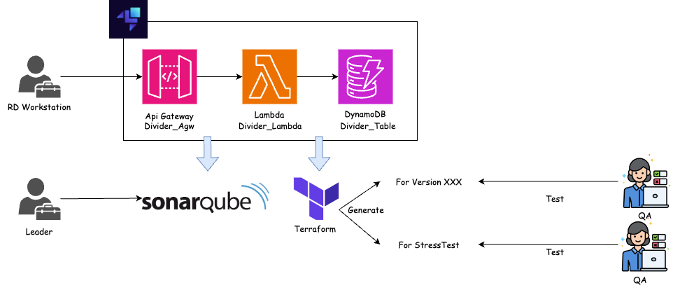

# 專案

基本的 ServerLess Platform Application 示意，搭配R&D WorkStack 與 Infrastructure Builder (Terraform) 。




# 先決條件

先進行必要的CLI安裝，方能進行環境的啟動，請安裝以下內容 :

* ✅ [**dotnet runtime**](https://dotnet.microsoft.com/en-us/download/dotnet/6.0): dotnet 運行環境 (6.0)。
* ✅ [**docker**](https://www.docker.com/products/docker-desktop/): 開發環境啟動與為程式代碼建置容器。
* ✅ [**go-task**](https://taskfile.dev/): 用作進行腳本管理。
* ✅ [**aws-cli**](https://docs.aws.amazon.com/zh_tw/cli/latest/userguide/getting-started-install.html): AWS 指令集，控制資源增減。
* ✅ [**terraform**](https://developer.hashicorp.com/terraform/install?product_intent=terraform): 建立雲服務自動化使用。
* ✅ [**jq**](https://jqlang.github.io/jq/download/): 支援腳本部分指令運作。
* ✅ [**dotnet sonars-canner**](https://docs.sonarsource.com/sonarqube/latest/analyzing-source-code/scanners/sonarscanner-for-dotnet/): SonarQube掃描dotnet sourcecode使用。
* ✅ [**Java SE**](https://www.oracle.com/tw/java/technologies/downloads/#jdk21-mac) : SonarQube runtime 需求。
* 🔲 [**Localsatck Desktop**](https://github.com/localstack/localstack-desktop) : GUI用於檢視本地端所建立的資源。
* 🔲 [**Commandeer**](https://getcommandeer.com/) : GUI用於檢視本地端所建立的資源。

# 專案目錄

```bash
├── DemoServerlessPlatform
|  ├── api                            
|  │    ├── Controller 
|  │    │   └── DemoController.cs                       #[API] 除法器進入點。
|  │    ├── iac
|  │    │   ├── agw.tf                                  #[API] 建置AWS 資源 (API Gateway)。
|  │    │   ├── dynamodb.tf                             #[API] 建置AWS 資源 (Dynamodb)。
|  │    │   ├── lambda.tf                               #[API] 建置AWS 資源 (Lambda)。
|  │    │   └── ...                                     #[API] 其他。
|  │    ├── taskfile.cloud.yml                          #[API] 建置雲端環境。
|  │    ├── taskfile.local.yml                          #[API] 建置本地環境。
|  ├── api.tests                        
|  │    └── DemoApiIntegrationTest.cs                   #[API] 測試DemoController。
|  ├── domain                                          
|  │    └── Divider.cs                                  #[Domain] 除法器。                  
|  ├── domain.tests                     
|  │    └── DividerUnitTes.cs                           #[Domain] 測試 Divider。 
|  ├── infrastructure                  
|  │    └── DividerRepository.cs                        #[Infrastructure] 寫入目標Table。 
|  ├── infrastructure.tests             
|  │    └── DividerRepositoryIntegrationTest.cs         #[Infrastructure] 測試DividerRepository。 
|  ├── misc                                     
|  │    ├── EnvironmentVariable.cs                      #[Misc] 環境變數。 
|  │    └── SystemUtil.cs                               #[Misc] Port Listenser。                        
|  └── testbase                       
|  │    ├── Cleaner.cs                                  #[testbase] 每個測試腳本進行後，進行資料清除。 
|  │    ├── IntegrationTestBase.cs                      #[testbase] 整合測試基底。  
|  │    ├── IntegrationTestFixture.cs                   #[testbase] 整合測試使用的共通物件。  
|  │    └── MockHttpClientFactory.cs                    #[testbase] 模擬HttpClient。   
|  ├── taskfile.testreport.yml                          #[root] 建立測試報告
|  ├── taskfile.yml                                     #[root] go-task 指令進入點

```

# 快速開始

 確認滿足此專案的[先決條件](#先決條件)後，運行以下指令:

* 建立本地環境

```sh
> task local-up
```

> 此指令會隱含執行 `local-deploy` 。

* 部屬本地應用

```sh
> task local-deploy
```

* 關閉本地環境

```sh
> task local-destroy
```


* 建立雲端環境

```sh
> task cloud-up
```


* 部屬雲端應用

```sh
> task --taskfile taskfile.cloud.deployment.<env>.yml cloud-deploy-lambda
```
> 此指令必要檔案會透過 `cloud-up` 動態產生。

* 刪除雲端環境

```sh
> task cloud-down
```

---
